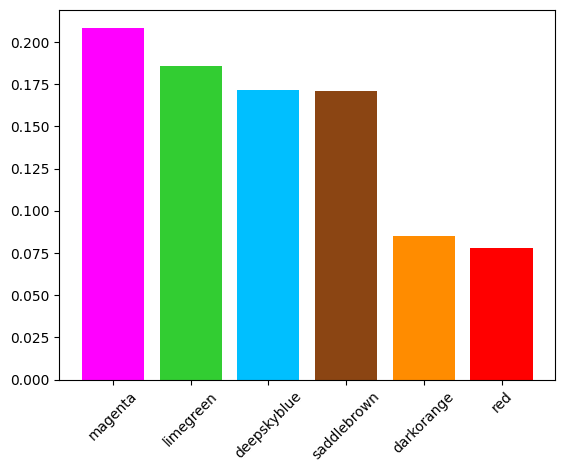
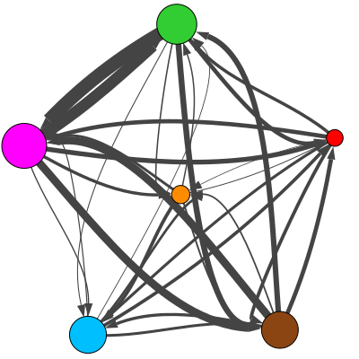
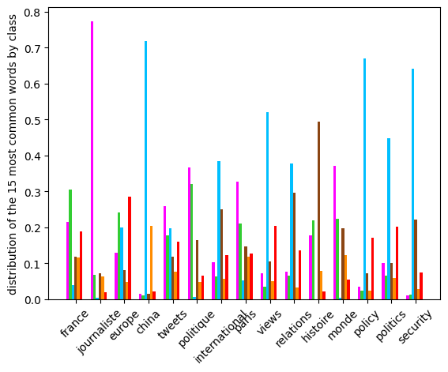
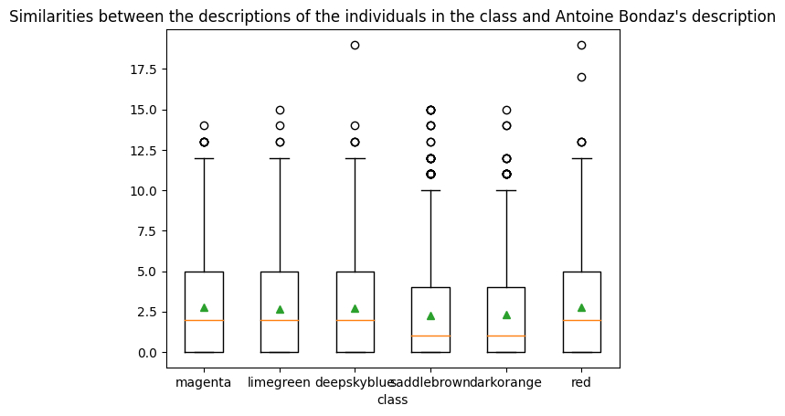
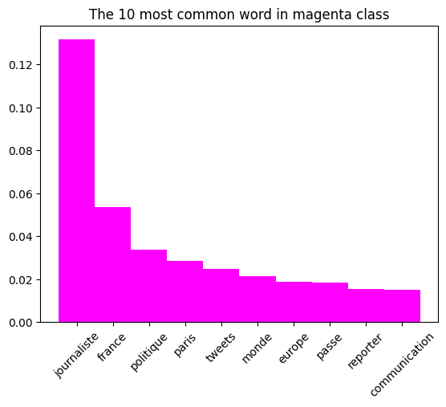

# twitter-graph : auto-report

| WARNING: This repo is under test ! |
| --- |

The main objective is to write an automatic report to facilitate the analysis of a twitter graph.

| Twitter-graph : To know how to make a twitter-graph, look [eleurent's repo](https://github.com/eleurent/twitter-graph): |
| --- |

## Installation

**Testing with python3.8**

Need pip packages:
| pip packages | tested version |
| --- | --- |
| python-docx | 0.8.11 |
| numpy | 1.19.5 |
| pandas | 0.25.3 |
| igraph | 0.9.9 |
| textdistance | 4.2.2 |
| matplotlib | 3.4.2 |

Install requirements with  :
> pip3 install -r requirements.txt

## How to use

```python
from autoReport import *

autoReport("nodes.csv", "edges.csv", 
            {2339:"magenta", 
            2433:"limegreen",
            2566:"deepskyblue",
            1052:"saddlebrown",
            2498:"darkorange",
            1583:"red"}, 
           {"name":"Antoine Bondaz", 
           "at":"@AntoineBondaz",
            "description":"""Foodie - 🕵🏼‍Research @FRS_org - 👨🏼‍🏫 Teach @SciencesPo - 🇨🇳🇹🇼🇰🇷🇰🇵's foreign & security policies - Ph.D."""},
            rank_col_name="pageranks",
            class_col_name="modularity_class",
        ).makeReport("out.docx",
                      per_edeges=1,
                      show_internal_link=False)

```

Creates a report _out.docx_ for Antoine Bondaz, with 6 class. nodes.csv have two columns : one with the rank of the nodes (default **pageranks**) and one with class (default **modularity_class**). If columns have special name, specify the argument class_col_name for class columns name and rank_col_name for rank column name in the construct.

### Advice
    - If your graph comes from the tweets search, you can add the tweets.json file with the tweets_path parameter (on the constructor) to have more graphics.
    - To test quickly, you can add the per_edeges=0.1 parameter (to the makeReport method) to test the link graph with 10% of edges. Important to verify the correct installation of igraph

If the size of the nodes is calculated with In-Degree and In-Degree is not in the columns of the csv nodes, you can specify `InDegree` for the `rank_col_name` parameter, it will calculate it.

## The report

The report is divided into 2 parts: the first one looks at the whole graph, the second one at each class.

### Introduction

#### Class distribution



#### Links between class



#### Most common words



#### Similarity of descriptions



## Class analysis

### Class magenta ( 20.9%)

#### Most 10 common words

